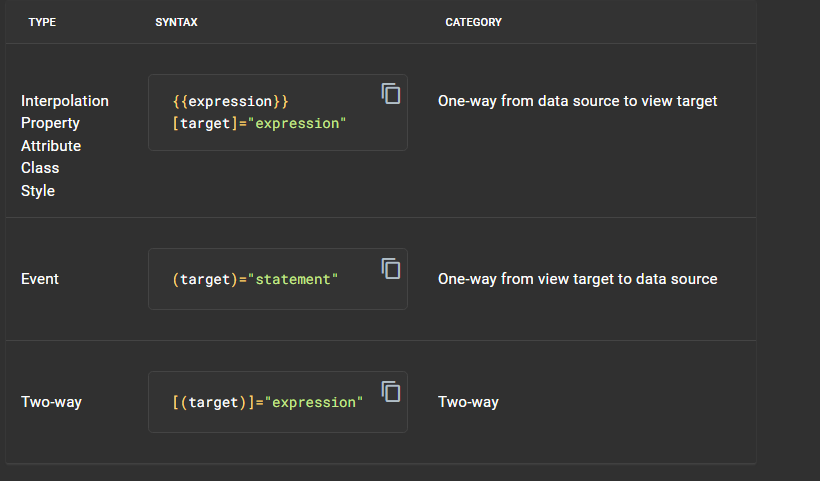

1. Explain about Angular components? + Template
// your-component-name.component.ts

import { Component } from '@angular/core';

@Component({
  selector: 'app-your-component', // HTML selector for using this component
  templateUrl: './your-component-name.component.html', // HTML template file
  styleUrls: ['./your-component-name.component.css'] // CSS styles for this component
})
export class YourComponentNameComponent {
  // Component logic and properties go here
  componentName = 'Your Component Name';
}

2. What is String interpolation?

 It allows you to dynamically insert values or expressions into the HTML content of your Angular components. In Angular, string interpolation is denoted by double curly braces {{ }}. Inside these braces, you can place expressions that will be evaluated and their results will be converted to strings and displayed in the template.

 3. Types of Binding in Angular? Interpolation vs Property vs Attribute vs Event(one way) vs Two Way? 

 
In Angular, there are several types of bindings that allow you to establish a connection between the components' TypeScript code and the HTML templates. Here are the main types of bindings in Angular with examples:

Interpolation (One-Way Binding):

Interpolation is a one-way binding technique that allows you to embed expressions within double curly braces ({{ }}) in the template. The expression is evaluated, and its result is converted to a string and inserted into the HTML at that location.
typescript
Copy code
// component.ts
export class AppComponent {
  greeting = 'Hello, Angular!';
}
html
Copy code
<!-- component.html -->

{{ greeting }}

Property Binding (One-Way Binding):

Property binding allows you to set the value of an HTML element property to the value of a corresponding property in the component.
typescript
Copy code
// component.ts
export class AppComponent {
  imageSource = 'path/to/image.jpg';
}
html
Copy code
<!-- component.html -->

Event Binding (One-Way Binding):

Event binding allows you to listen for and respond to DOM events triggered by the user or by the application.
typescript
Copy code
// component.ts
export class AppComponent {
  handleClick() {
    console.log('Button Clicked!');
  }
}
html
Copy code
<!-- component.html -->
<button (click)="handleClick()">Click me</button>
Two-Way Binding ([(ngModel)]):

Two-way binding combines property binding and event binding, allowing data to flow in both directions. It is often used with forms to bind input fields to component properties and update both the view and the component when the user interacts with the form.
typescript
Copy code
// component.ts
export class AppComponent {
  username = 'John Doe';
}
html
Copy code
<!-- component.html -->
<input [(ngModel)]="username" />
Note: For two-way binding using [(ngModel)], you need to import the FormsModule from @angular/forms in your module.

Attribute Binding:

Attribute binding allows you to set the value of an HTML element attribute.
typescript
Copy code
// component.ts
export class AppComponent {
  isDisabled = true;
}
html
Copy code
<!-- component.html -->
<button [attr.disabled]="isDisabled">Click me</button>
Class Binding:

Class binding allows you to conditionally apply CSS classes based on the evaluation of an expression.
typescript
Copy code
// component.ts
export class AppComponent {
  isError = true;
}
html
Copy code
<!-- component.html -->

This is an error message

Here, if isError is true, the CSS class error will be applied.

Style Binding:

Style binding allows you to conditionally apply inline styles based on the evaluation of an expression.
typescript
Copy code
// component.ts
export class AppComponent {
  isHighlighted = true;
}
html
Copy code
<!-- component.html -->

  This is a highlighted area

Here, if isHighlighted is true, the background color will be set to yellow.

These binding types provide a powerful way to create dynamic and interactive Angular applications by establishing connections between the component logic and the HTML templates.

5. Explain Angular component meta-data?

@Component({
  standalone: true,
  selector:    'app-hero-list',
  templateUrl: './hero-list.component.html',
  imports:     [ NgFor, NgIf, HeroDetailComponent ],
  providers:  [ HeroService ] // inject service only for this component instance
})
export class HeroListComponent implements OnInit {
  /* . . . */
}

standalone	true when this is a self-describing, "Standalone" component. If false or unspecified, the component must be declared in an ngModule which is an older style. Prefer true if you can.
selector	A CSS selector that tells Angular to create and insert an instance of this component wherever it finds the corresponding tag in template HTML. For example, if an application's HTML contains <app-hero-list></app-hero-list>, then Angular inserts an instance of the HeroListComponent view between those tags.
templateUrl	The relative address of this component's HTML template. Alternatively, you can provide the HTML template inline, as the value of the template property. This template defines the component's host view.
imports	An array of the components, directives, and packages that your template references. Essential for "Standalone" components.
providers	An array of providers for services that the component requires. In the example, this tells Angular how to provide the HeroService instance that the component's constructor uses to get the list of heroes to display.

6. Explain types of Data Binding?

Types of data binding:

Angular provides three categories of data binding according to the direction of data flow:

From source to view
From view to source
In a two-way sequence of view to source to view

Binding types other than interpolation have a target name to the left of the equal sign. The target of a binding is a property or event, which you surround with square bracket ([ ]) characters, parenthesis (( )) characters, or both ([( )]) characters.

The binding punctuation of [], (), [()], and the prefix specify the direction of data flow.

Use [] to bind from source to view
Use () to bind from view to source
Use [()] to bind in a two-way sequence of view to source to view

7. Explain Template variable in angular?
Template variables help you use data from one part of a template in another part of the template. Use template variables to perform tasks such as respond to user input or finely tune your application's forms.

<input #phone placeholder="phone number" />

<!-- lots of other elements -->

<!-- phone refers to the input element; pass its `value` to an event handler -->
<button type="button" (click)="callPhone(phone.value)">Call</button>

