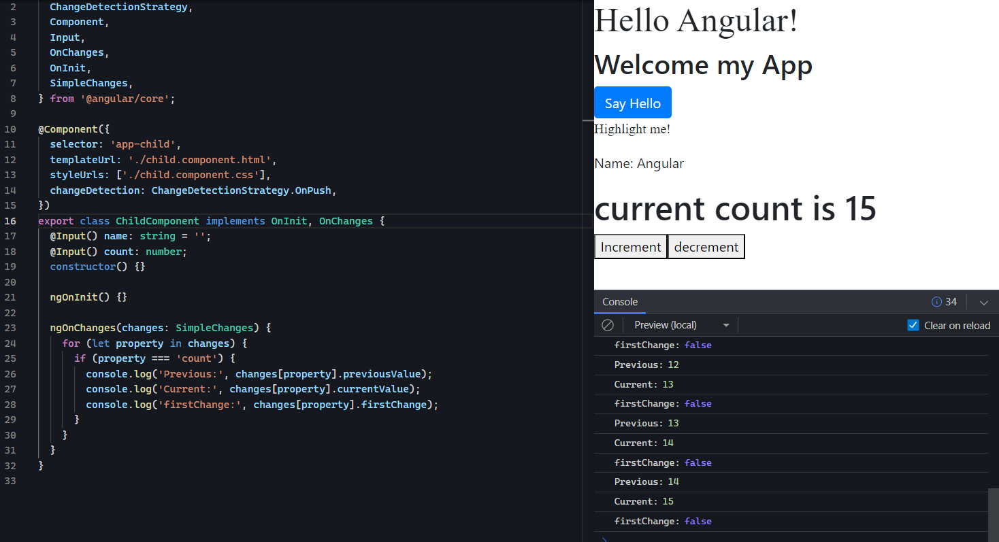
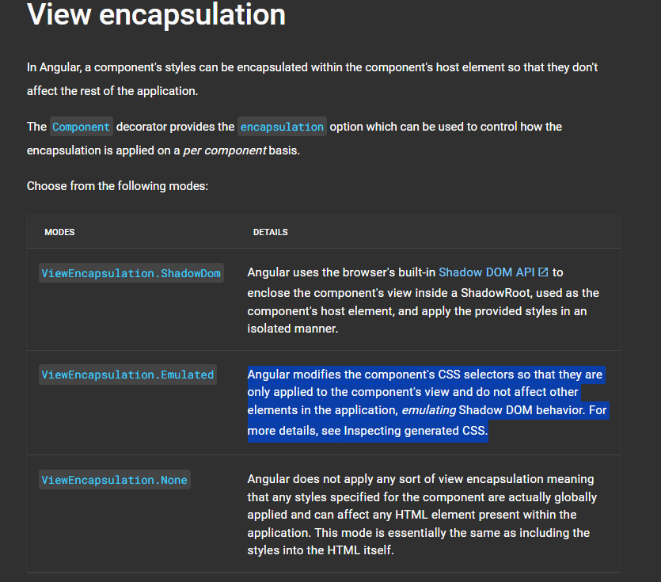
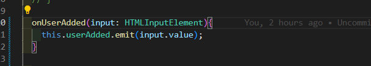
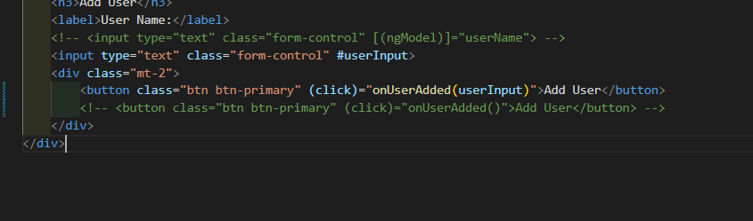
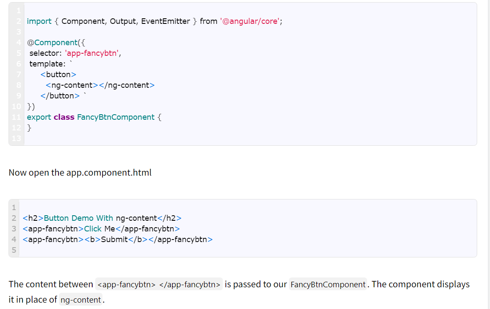
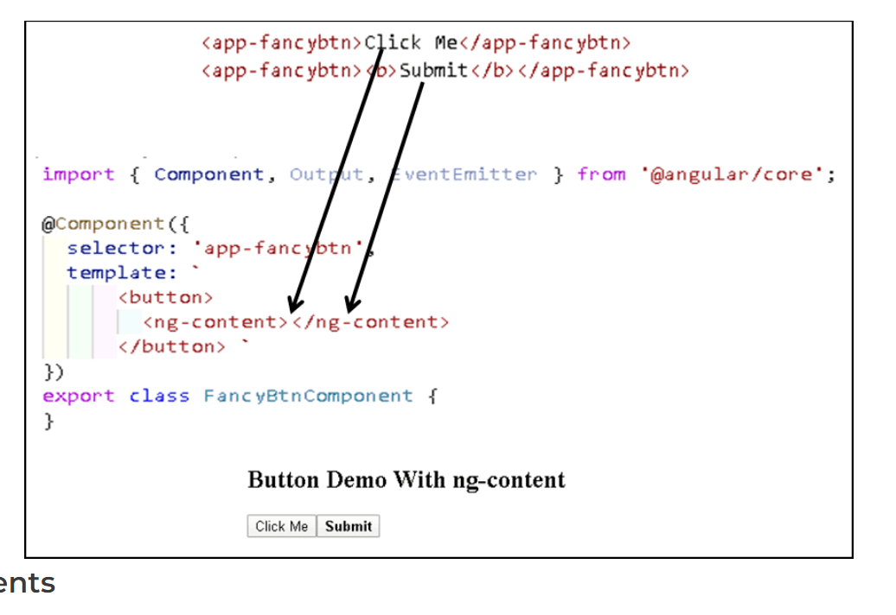
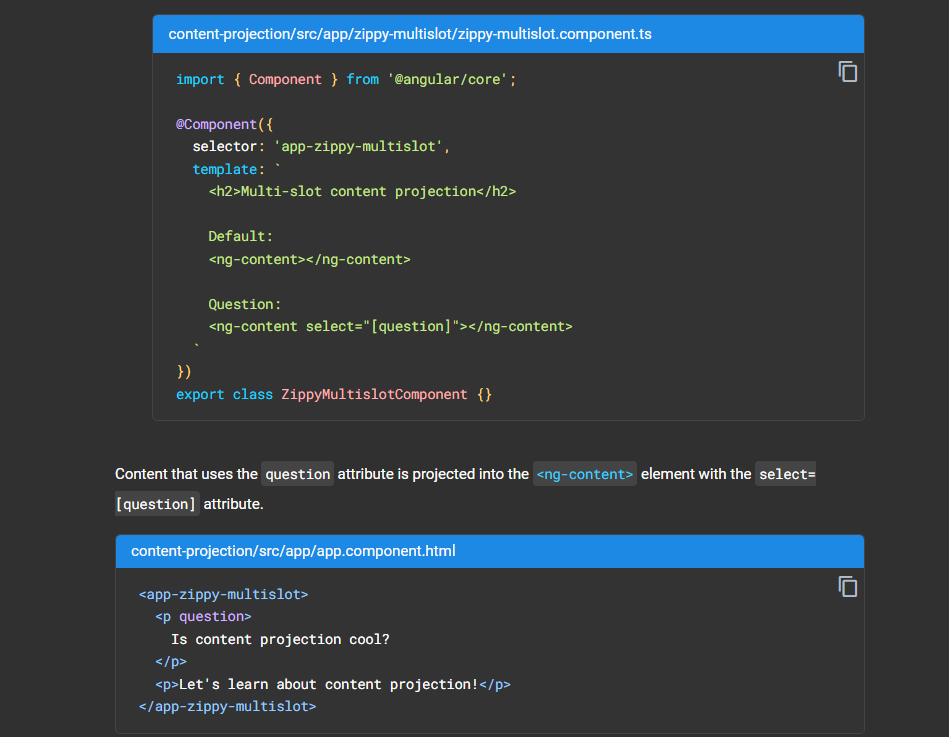
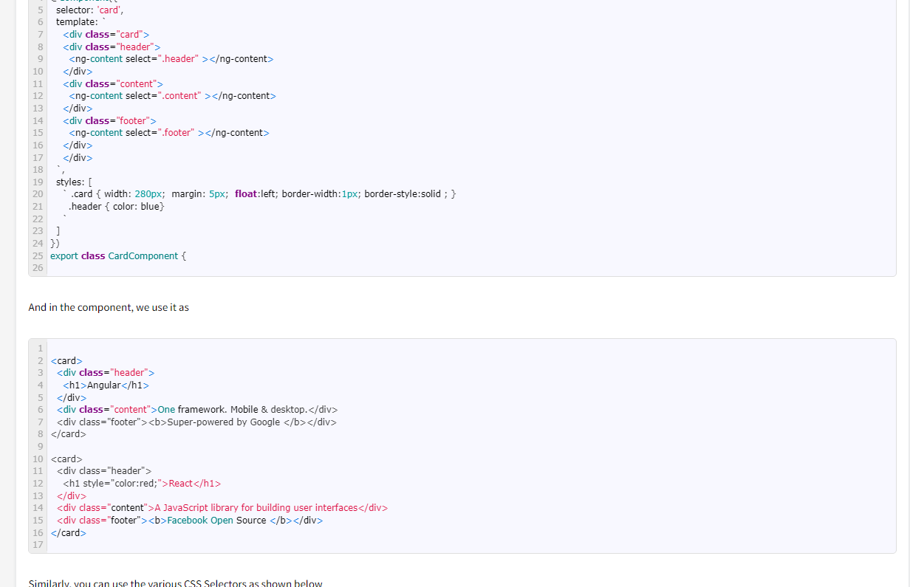
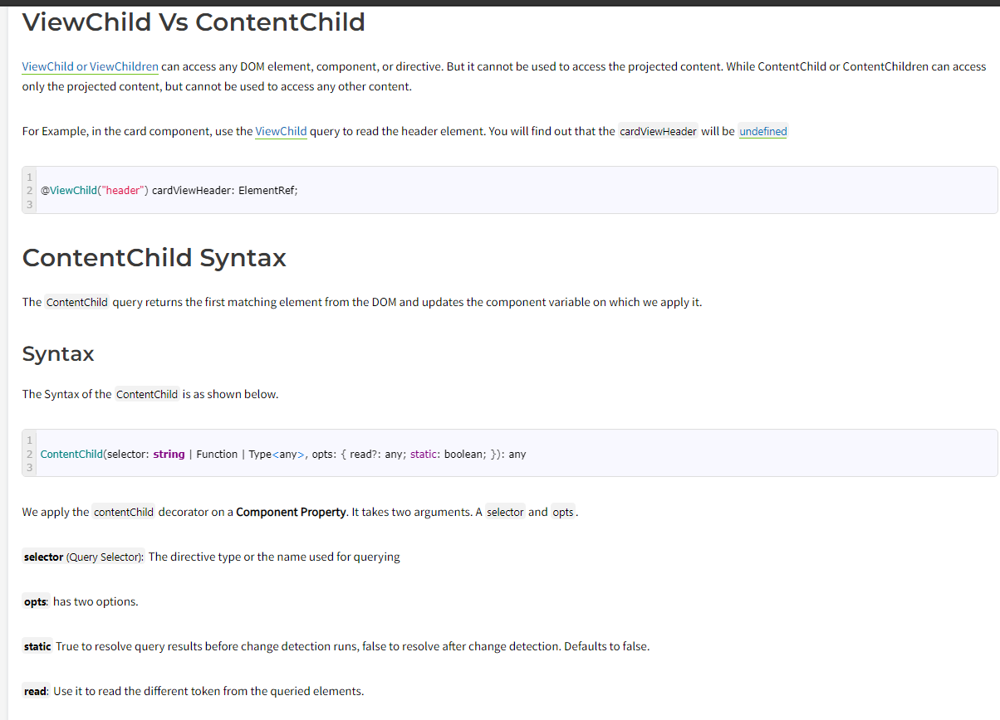

1. Explain Scenarios of Component communication?
There are few ways in which components can communicate or share data between them. And methods depend on whether the components have a Parent-child relationship between them are not.

Here are the three Possible scenarios

Parent to Child Communication
Child to Parent Communication
Interaction when there is no parent-child relation

2. Explain Parent to Child Communication?
https://www.tektutorialshub.com/angular/angular-passing-data-child-component/
3. Explain how we can track Input changes by using ngOnChanges?

Detect and act upon changes to input property values with the ngOnChanges() method of the OnChanges lifecycle hook interface.

4. Explain Child to Parent communication?

There are three ways in which the parent component can interact with the child component

Listens to Child Event
Uses Local Variable to access the child
Uses a @ViewChild to get the reference to the child component

https://www.tektutorialshub.com/angular/angular-pass-data-to-parent-component/

When a parent component interacts with a child component in Angular, there are two primary approaches: using a local variable and using ViewChild. Each approach has its use cases, and the choice depends on the specific requirements of the application.
he local variable approach is straightforward. But it is limited because the parent-child wiring must be done entirely within the parent template. The parent component itself has no access to the child.

You can't use the local variable technique if the parent component's class relies on the child component's class. The parent-child relationship of the components is not established within each component's respective class with the local variable technique. Because the class instances are not connected to one another, the parent class cannot access the child class properties and methods.

When the parent component class requires that kind of access, inject the child component into the parent as a ViewChild.

1. Using Local Variable:
Parent Component Template:
html
Copy code
<app-child #childRef></app-child>
<button (click)="callChildMethod()">Call Child Method</button>
Parent Component TypeScript:
typescript
Copy code
import { Component } from '@angular/core';
import { ChildComponent } from './child.component';

@Component({
  selector: 'app-parent',
  template: `
    <app-child #childRef></app-child>
    <button (click)="callChildMethod()">Call Child Method</button>
  `,
})
export class ParentComponent {
  callChildMethod() {
    this.childRef.someMethod();
  }
}
Child Component TypeScript:
typescript
Copy code
import { Component } from '@angular/core';

@Component({
  selector: 'app-child',
  template: '
Child Component
',
})
export class ChildComponent {
  someMethod() {
    console.log('Method in child component called from parent');
  }
}
2. Using ViewChild:
Parent Component TypeScript:
typescript
Copy code
import { Component, ViewChild } from '@angular/core';
import { ChildComponent } from './child.component';

@Component({
  selector: 'app-parent',
  template: `
    <app-child></app-child>
    <button (click)="callChildMethod()">Call Child Method</button>
  `,
})
export class ParentComponent {
  @ViewChild(ChildComponent, { static: true }) childComponent: ChildComponent;

  callChildMethod() {
    this.childComponent.someMethod();
  }
}
Child Component TypeScript:
typescript
Copy code
import { Component } from '@angular/core';

@Component({
  selector: 'app-child',
  template: '
Child Component
',
})
export class ChildComponent {
  someMethod() {
    console.log('Method in child component called from parent');
  }
}
Considerations:
Local Variable Approach:

Pros:
Simple and straightforward, especially for one-to-one parent-child interactions.
Clear in the template, making it easy to understand the relationship.
Cons:
Might lead to a tight coupling between the parent and child components.
Not suitable for scenarios where multiple instances of the child component are present.
ViewChild Approach:

Pros:
More flexible, suitable for scenarios with multiple instances of the child component.
Can be used for both querying child components and accessing their properties or methods.
Cons:
Adds some complexity to the code.
Can lead to potential timing issues, especially if the child component is conditionally created.
Recommendation:
For simple interactions with a single instance of a child component, using a local variable is often sufficient and more straightforward.

For scenarios with multiple instances of the child component or more complex interactions, ViewChild provides more flexibility and control.

Ultimately, the choice between local variables and ViewChild depends on the specific needs and complexity of the application.

3. Explain View Encapsulation in angular?

What is the difference between Angular's ViewEncapsulation.ShadowDom to ViewEncapsulation.Emulated?

Answer: ViewEncapsulation.Emulated will add the css style in the head section of your website(and reference your component's unique id(_ngcontent) to apply it). ViewEncapsulation.ShadowDom will add the css style inside the generated DOM of your component.

You could decorate your component with these two encapsulation and see the change in the style declaration in your website.

Note: ShadowDom is not supported by some of the legacy browsers.

Now performance-wise I think that ShadowDom will be better as the style are declared inside your component's div.

While Emulated will be better if you want to target the legacy browser as well.

8. Local Reference in Angular ? eg HTMLInputElement?

9. Access HTML Elements in The DOM & Template with @ViewChild and the type ElementRef in Angular.
Template Code:
<input type="text" class="form-control" #userInput>
Component Code:
 @ViewChild('userInput') userInput :ElementRef;

10. Projecting the HTML Content written between the component using ng-content in Angular.

 Content projection is a way to pass the HTML content from the parent component to the child component. The child component will display the template in a designated spot. We use the ng-content element to designate a spot in the template of the child component. The ng-content also allows us to create multiple slots using the selector attribute. The parent can send different content to each slot.

 
 

 Multiple Projection:
 
 

ngProjectAs:

ngProjectAs
Sometimes it becomes necessary to wrap the component using the ng-container. Most of the time when you use a structural directive like ngIf or ngSwitch.

In the following example, we enclosed the header inside the ng-container.
 
<card>
  <ng-container>
    

      <h1 style="color:red;">React</h1>
    

  </ng-container>
  
A JavaScript library for building user interfaces

  
<b>Facebook Open Source </b>

</card>
 
 
Because of the ng-container, the header section is not projected to the header slot. Instead, it is projected to the ng-content slot which does not have a selector set.

To help in such a scenario, you can make use of ngProjectAs attribute as shown below.

 
<card>
  <ng-container ngProjectAs="header">
    

      <h1 style="color:red;">React</h1>
    

  </ng-container>
  
A JavaScript library for building user interfaces

  
<b>Facebook Open Source </b>

</card>

11. Explain about Understanding ViewChild, ViewChildren & Querylist in Angular?
The ViewChild or ViewChildren decorators are used to Query and get the reference of the DOM element in the Component. ViewChild returns the first matching element and ViewChildren returns all the matching elements as a QueryList of items. We can use these references to manipulate element properties in the component.

There are times when a parent component needs access to his children. Let’s see how we can handle this with Angular.

@ViewChildren —
Returns the specified elements or directives from the view DOM as QueryList

For example, let’s create a simple alert component.

Now let’s use this component multiple times in our app component and use the @ViewChildren decorator.

We can use the @ViewChildren decorator to grab elements from the host view.

The @ViewChildren decorator supports directive or component type as parameter, or the name of a template variable.

When the parameter is a component/directive the return value will be the component/directive instance.

When the parameter is the name of a template variable, the return value will be a reference to the native element.

Note: In this case, it will make more sense to use the @ViewChild decorator because this is only a single element.

The read parameter —
As we said by default, the ViewChildren decorator will return the component instance, but you can ask for other tokens:

The native DOM element —

ViewContainerRef — You need this token when you need to create templates or components dynamically

QueryList —
The return type of ViewChildren is QueryList. QueryList is just a fancy name for an object that stores a list of items. What is special about this object is when the state of the application changes Angular will automatically update the object items for you.

QueryList implements an iterable interface, therefore, it can be used in Angular templates with the ngFor directive. ( you can read more about this topic here )

QueryList API —
Getters —

first — get the first item
last — get the last item
length — get the items length
Methods —

map(), filter() , find(), reduce(), forEach(), some().

toArray() — returns the items as javascript array
changes() — Changes can be observed by subscribing to the changes Observable. Any time a child element is added, removed, or moved, the query list will be updated, and the changes observable of the query list will emit a new value.
Remember —
The QueryList is initialized only before the ngAfterViewInit lifecycle hook, therefore, is available only from this point.

ViewChildren vs ContentChildren —
ViewChildren don’t include elements that exist within the ng-content tag.

ContentChildren includes only elements that exists within the ng-content tag.

@ContentChildren —
Returns the specified elements or directives from the content DOM as QueryList

Remember —
The QueryList is initialized only before the ngAfterContentInit lifecycle hook, therefore, is available only from this point.

12. difference between content child vs view child?

In Angular, both ContentChild and ViewChild are decorators used to query and get references to elements or components within a parent component. However, there is a key difference in what they allow you to query:

ContentChild:

Usage: Used to query and get a reference to the first occurrence of a directive or component within the content of a component. It looks for the directive or component in the content projection of the parent component.
Decorator: @ContentChild(selector)
Example:
typescript
Copy code
@ContentChild(MyDirective) myDirective: MyDirective;
When to Use:
When you want to access content that is projected into the component using <ng-content></ng-content>.
ViewChild:

Usage: Used to query and get a reference to the first occurrence of a directive or component within the view of a component. It looks for the directive or component in the template of the parent component.
Decorator: @ViewChild(selector)
Example:
typescript
Copy code
@ViewChild(MyComponent) myComponent: MyComponent;
When to Use:
When you want to access elements or components that are part of the parent component's view and are defined within the template.

https://netbasal.com/understanding-viewchildren-contentchildren-and-querylist-in-angular-896b0c689f6e
