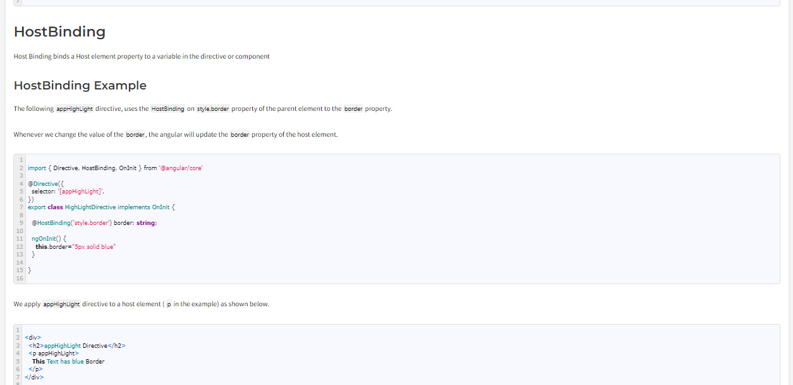
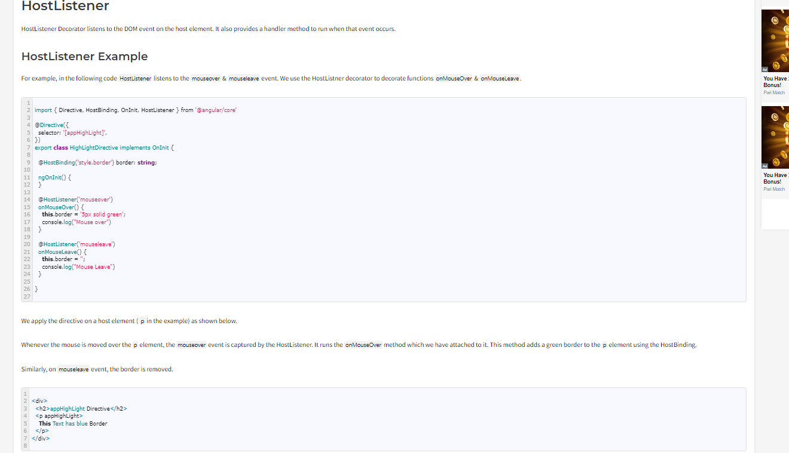
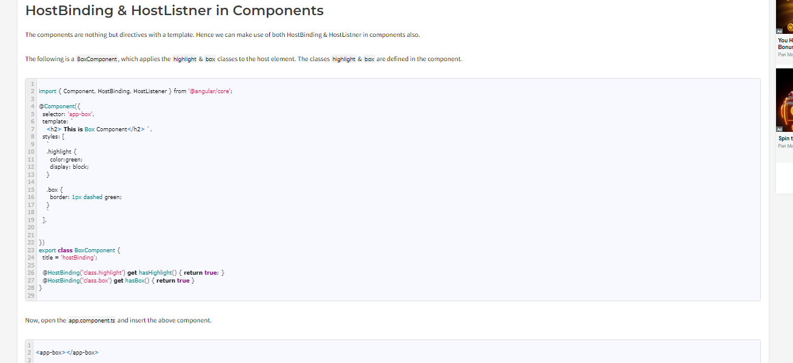

1. What are directives and its types?
In Angular, directives are a way to extend and modify the behavior of HTML elements. There are three main types of directives: structural directives, attribute directives, and custom directives. Let's explore each type with examples:

1. Structural Directives:
Structural directives change the structure of the DOM by adding, removing, or manipulating elements. They are preceded by an asterisk (*) in the HTML.

Example: *ngIf
The *ngIf directive conditionally adds or removes an element based on the truthiness of an expression.

html
Copy code
<!-- Only display the element if showElement is true -->

This element is shown conditionally

Example: *ngFor
The *ngFor directive is used for iterating over a collection (e.g., an array) and creating multiple instances of a template.

html
Copy code
<!-- Iterate over an array and create a list -->
<ul>
  <li *ngFor="let item of items">{{ item }}</li>
</ul>

Example : *ngSwitch
In a situation where you may want to conditionally show more than two options, using the [ngSwitch] directive works great! This directive will work just like a switch statement in JavaScript, and will allow as many cases as are needed. The syntax is to put [ngSwitch]="switch_expression" on the containing element, then put *ngSwitchCase="match_expression" on each element that is a separate case. Additionally, an element can be the default element by adding *ngSwitchDefault in place of the *ngSwitchCase. An example of this could look like this:

  
This is the default that you're seeing!

  
You're now seeing Variation 1!

  
You're now seeing Variation 2!

  
You're now seeing Variation 3!

  
You're now seeing Variation 4!

2. Attribute Directives:
Attribute directives modify the appearance or behavior of an element, component, or another directive.

Example: ngStyle
The ngStyle directive allows you to set multiple styles for an element based on an expression.

html
Copy code
<!-- Set the background color and font size dynamically -->

Styled Div

Example: ngClass
The ngClass directive dynamically adds or removes CSS classes based on an expression.

html
Copy code
<!-- Add or remove 'highlight' class based on the condition -->

Highlight me

2. Explain Trackby in ngFor?
Angular Trackby option improves the Performance of the ngFor if the collection has a large no of items and keeps changing.
NOTE: EXPLAIN TRACK BY WITH MOVIE LIST EXAMPLE IN INTERVIEW

When you use ngFor to iterate over a collection and bind it to the DOM, Angular needs a way to track changes in the collection and update the corresponding DOM elements accordingly. The default behavior is to use the index of each item as a key for tracking changes. However, in some cases, using a unique identifier (like an ID) is more efficient and can prevent unnecessary re-rendering of elements.

Here's an example to illustrate the use of trackBy:

typescript
Copy code
// app.component.ts
import { Component } from '@angular/core';

interface Item {
  id: number;
  name: string;
}

@Component({
  selector: 'app-root',
  template: `
    <ul>
      <li *ngFor="let item of items; trackBy: trackById">
        {{ item.name }}
      </li>
    </ul>

    <button (click)="addItem()">Add Item</button>
  `
})
export class AppComponent {
  items: Item[] = [
    { id: 1, name: 'Item 1' },
    { id: 2, name: 'Item 2' },
    { id: 3, name: 'Item 3' }
  ];

  trackById(index: number, item: Item): number {
    return item.id;
  }

  addItem() {
    const newItem: Item = { id: this.items.length + 1, name: `Item ${this.items.length + 1}` };
    this.items.push(newItem);
  }
}

4. Explain Custom Directive?
The Angular directives help us to extend or manipulate the DOM. We can change the appearance, behavior, or layout of a DOM element using the directives.
Create a custom directive using the @Directive decorator.
We will create both custom attribute directive & custom Structural directive.
How to setup selectors
Pass value to it using the @input.
How to respond to user inputs,
Manipulate the DOM element (Change the Appearance) etc.

Example for Custom Attribute Directive:
@Directive({
    selector : '[appUnderLine]'
})

export class UnderlineDirective {

  constructor(private el: ElementRef, private renderer: Renderer2) { }

  @HostListener('mouseenter') onMouseEnter() {
    this.addUnderline();
  }

  @HostListener('mouseleave') onMouseLeave() {
    this.removeUnderline();
  }

  private addUnderline() {
    this.renderer.setStyle(this.el.nativeElement, 'text-decoration', 'underline');
  }

  private removeUnderline() {
    this.renderer.removeStyle(this.el.nativeElement, 'text-decoration');
  }
}

5. Explain ng-template?
The ng-template is an Angular directive that defines a template. Templates are chunks of HTML or other Angular elements that can be included and reused in various parts of your application. They are often used in conjunction with structural directives like *ngIf, *ngFor, and custom structural directives.

Content to render when condition is true.

Content to render when condition is true.

<ng-template #elseBlock>Content to render when condition is false.</ng-template>

<ng-template #thenBlock>Content to render when condition is true.</ng-template>
<ng-template #elseBlock>Content to render when condition is false.</ng-template>

6. Explain ng-container?
The <ng-container> allows us to use structural directives without any extra element, making sure that the only DOM changes being applied are those dictated by the directives themselves.

This not only increases performance (even so slightly) since the browser ends up rendering less elements but can also be a valuable asset in having cleaner DOMs and styles alike.

ng-container is an Angular directive that serves as a grouping element without creating an additional element in the DOM. It's a structural directive that is useful when you want to apply structural directives (such as *ngIf, *ngFor, or ngSwitch) to multiple elements but don't want to introduce a wrapper element in the DOM.

Here are a few use cases and examples of ng-container:

1. Grouping Multiple Elements:
html
Copy code
<!-- Without ng-container -->

  
Content to show when condition is true

  Additional content

<!-- With ng-container -->
<ng-container *ngIf="condition">
  
Content to show when condition is true

  Additional content
</ng-container>

2. *ngFor with Multiple Elements:
html
Copy code
<!-- Without ng-container -->

  
{{ i + 1 }}. {{ item }}

  Additional content

<!-- With ng-container -->
<ng-container *ngFor="let item of items; let i = index">
  
{{ i + 1 }}. {{ item }}

  Additional content
</ng-container>

3. Explain ngTemplateOutlet?
The NgTemplateOutlet directive can be applied to any element but most of the time it's applied to <ng-container> ones. By combining the two, we get a very clear and easy to follow HTML and DOM structure in which no extra elements are necessary and template views are instantiated where requested.
Angular template outlets can be used to insert a common template in various sections of a view that are not generated by a loop or subject to a condition. For example, you can define a template for the logo of a company and insert it in several places in the page:

  <ng-container *ngTemplateOutlet="companyLogoTemplate"></ng-container>
  <h1>Company History</h1>
  
{{companyHistory}}

<form (ngSubmit)="onSubmit()">
  <ng-container *ngTemplateOutlet="companyLogoTemplate"></ng-container>
  <h1>User info</h1>
  <label>Name:</label><input type="text" [(ngModel)]="userName" />
  <label>Account ID:</label><input type="text" [(ngModel)]="accountId" />
  <button>Submit</button>
</form>

  <ng-container *ngTemplateOutlet="companyLogoTemplate"></ng-container>

<ng-template #companyLogoTemplate>
  

    
    <label>The ACME company, {{employeeCount}} people working for you!</label>
  

</ng-template>

5.  ElementRef?
https://medium.com/@anooprvarrier/angular-elementref-interface-c826cd5db732

4.  Using Renderer2 to create the custom attribute directive to maipulate DOM in Angular

Why not ElementRef?
We can use the nativeElement property of the ElelemtRef to manipulate the DOM. We learned this in our last tutorial on ElementRef. The nativeElement Property contains the reference to the underlying DOM object. This gives us direct access to the DOM, bypassing the Angular. There is nothing wrong with using it, but it is not advisable for the following reasons.

Angular keeps the Component & the view in Sync using Templates, data binding & change detection, etc. All of them are bypassed when we update the DOM Directly.

Renderer2 is a utility class that provides methods to manipulate and interact with the DOM (Document Object Model). It is used to perform operations such as creating, modifying, and removing elements, applying styles, and listening to events.

Here's an example of how you can use Renderer2 in Angular:

Import the necessary modules and services:
import { Component, Renderer2, ElementRef } from '@angular/core';
Inject the Renderer2 and ElementRef into your component's constructor:
constructor(private renderer: Renderer2, private el: ElementRef) { }
Use the Renderer2 methods to manipulate the DOM in your component's methods or lifecycle hooks. For example, let's say you have a button in your template and you want to change its background color when it is clicked:
@Component({
  selector: 'app-example',
  template: `
    <button (click)="changeColor()">Change Color</button>
  `
})
export class ExampleComponent {
  changeColor() {
    const button = this.el.nativeElement.querySelector('button');
    this.renderer.setStyle(button, 'background-color', 'red');
  }
}
In the above example changeColor() method, we use this.el.nativeElement.querySelector('button') to get a reference to the button element in the DOM. Then, we use this.renderer.setStyle() to set the background color of the button to red.

Note that using Renderer2 is recommended when you need to manipulate the DOM directly in Angular, as it provides a safer way to interact with the DOM compared to directly accessing and modifying the DOM elements using vanilla JavaScript.
All about renderer2 :https://www.positronx.io/using-renderer2-angular/

5. Explain Hostlistner and Hostbinding?
The HostBinding & HostListener are decorators in Angular. HostListener listens to host events, while HostBinding allows us to bind to a property of the host element. The host is an element on which we attach our component or directive. This feature allows us to manipulate the host styles or take some action whenever the user performs some action on the host element.

HostBinding:

HostListner : 
