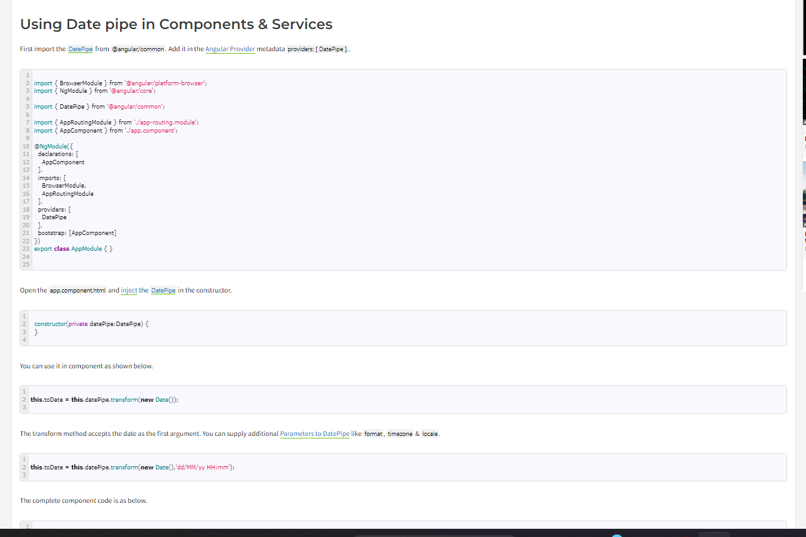

 1. Pipes in Angular. Chaining Multiple Pipes, parameterized Pipes in the Angular.

 Pipes are simple functions to use in template expressions to accept an input value and return a transformed value. Pipes are useful because you can use them throughout your application, while only declaring each pipe once.

 
Expression | pipeOperator[:pipeArguments]
 
Where

Expression: is the expression, which you want to transform
| : is the Pipe Character
pipeOperator : name of the Pipe
pipeArguments: arguments to the Pipe

 
import { Component } from '@angular/core';
import { FormsModule } from '@angular/forms';
 
@Component({
    selector: 'app-root',
    templateUrl: `
 Unformatted date : {{toDate }} 

                  
 Formatted date : {{toDate | date}} 
` 
}) 
export class AppComponent 
{ 
    title: string = 'pipe Example' ; 
    toDate: Date = new Date(); 
}
 Passing arguments to pipes
We can also pass optional arguments to the pipe. The arguments are added to the pipe using a colon (:) sign followed by the value of the argument. If there are multiple arguments separate each of them with the colon (:). For example, we can pass the format as the argument to the date pipe, which is Optional. The medium is one of the valid value of the format argument, which displays the date in yMMMdjms format. The example code is as shown below.

{{toDate | date:'medium'}}

Chaining Pipes
Pipes can be chained together to make use of multiple pipes in one expression. For example in the following code, the toDate is passed to the Date Pipe. The output of the Date pipe is then passed to the uppercase pipe.
 
toDate | date | uppercase

2. Create a custom Pipe and pass parameters to the Pipe in Angular using Transform method - Angular
3. Creating Filter Pipe in the Angular. Filter the list of data with search string in Angular

import { Pipe, PipeTransform } from '@angular/core';

@Pipe({
  name: 'filter',
  pure: false
})
export class FilterPipe implements PipeTransform {

  transform(value: any, filterString: string) {
    if (value.length === 0 || filterString === '') {
      return value;
    }

    const users = [];
    for (const user of value) {
      if (user['name'] === filterString) {
        users.push(user);
      }
    }
    return users;
  }

  

}

4. Using Angular Pipes in Components or Services

In this guide let us learn how to use Angular Pipes in components & Services. We usually use Angular Pipes in the template. But a pipe is nothing but a class with a method transform. Whether it is a built-in pipe or custom pipe, we can easily use it in an angular component or service.

5. Pure vs Impure Pipe?

Pipes let us render items in component templates in the way we want.

There are two kinds of pipes in Angular—pure and impure pipes. A pure pipe is a pipe that is run when a primitive JavaScript input value like strings, numbers, booleans, symbols or an object reference change.

Pure pipes must be pure functions. Pure functions take an input and return an output. They don’t have side effects. Changes within objects are ignored with pure pipes. When any changes take place, the pipe will run and the latest change will be rendered.

Impure pipes are pipes that can detect changes within objects and arrays.

Pure & impure Pipes

pure pipes are the pipes which are executed only when a "PURE CHANGE" to the input value is detected.

A pure change is either a change to a primitive input (string, number etc) value. or changed Object reference.

by default a pipe is pure pipe.

So impure pipe executes everytime irrespective of source has changed or not. which leads to bad performance. thats why it is not recommneded to use pipes for filtering data.

To make a pipe impure:

@Pipe({
  name: 'empFilter',
  pure: false  // default is set to true.
})
export class EmpFilterPipe implements PipeTransform {

  transform(employees: Employee[], searchValue?: string): Employee[] {
  
   }
}
<input type="text" [(ngModel)]="searchValue">
<button (click)="changeData()"></button>

changeData(): void{
    this.employees[0].name = "SOMETHING ELSE";
}

    {{emp.name}}

 
NOTE: if the pipe is pure and employees data is changed using method changeData(), which modifies the property of an employee in the array, the change is not passed to the pipe for transform. The transform will not happen again since the input value to the EmpFilterPipe is the employees array, an object/reference which has not been changed (only its properties have changed), and pure pipes only notice object/reference changes.

6. Understanding the async (Asynchronous) Pipe. How to use Async Pipe in the Angular.

The AsyncPipe in Angular is a special pipe that is designed to work with Observables and Promises. It simplifies the process of subscribing to Observables or handling Promises in Angular templates, automatically managing the subscription and updating the view when the data is received.

Here's how you can use the AsyncPipe in Angular:

1. Observables:
Assuming you have a component with a service method that returns an Observable, here's how you can use the AsyncPipe in your component template:

typescript
Copy code
import { Component, OnInit } from '@angular/core';
import { Observable } from 'rxjs';
import { DataService } from 'path-to-your-data-service';

@Component({
  selector: 'app-example',
  template: `
    

      <!-- Display data when available -->
      {{ data }}
    

    <ng-template #loading>
      <!-- Display a loading message or spinner when data is still loading -->
      Loading...
    </ng-template>
  `,
})
export class ExampleComponent implements OnInit {
  data$: Observable<any>;

  constructor(private dataService: DataService) {}

  ngOnInit() {
    this.data$ = this.dataService.getData();
  }
}
In this example, data$ is an Observable that comes from the getData method in your service. The *ngIf directive with the async pipe subscribes to the Observable and automatically updates the view when new data is emitted. The else block is used to display a loading message while the data is still being fetched.

2. Promises:
If your data is provided as a Promise, you can use the AsyncPipe in a similar way:

typescript
Copy code
import { Component } from '@angular/core';
import { DataService } from 'path-to-your-data-service';

@Component({
  selector: 'app-example',
  template: `
    

      <!-- Display data when available -->
      {{ data }}
    

    <ng-template #loading>
      <!-- Display a loading message or spinner when data is still loading -->
      Loading...
    </ng-template>
  `,
})
export class ExampleComponent {
  data$: Promise<any>;

  constructor(private dataService: DataService) {
    this.data$ = this.dataService.getData();
  }
}
In this case, the data$ property is a Promise returned by the getData method. The *ngIf and async pipe combination still handles the subscription and view update automatically.

Using the AsyncPipe helps to avoid manual subscription management and ensures that the view reflects the most up-to-date data as it becomes available. It's a convenient tool for working with asynchronous data in Angular applications.