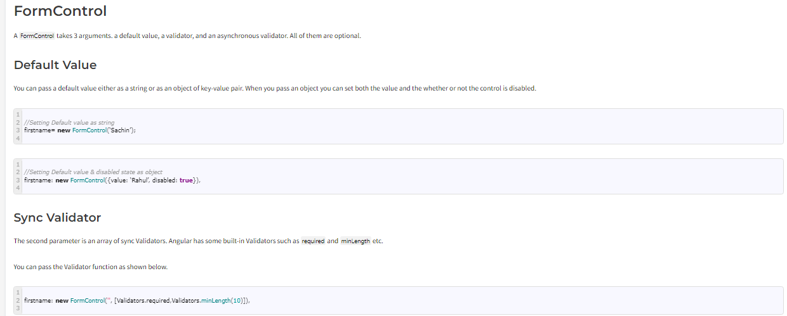
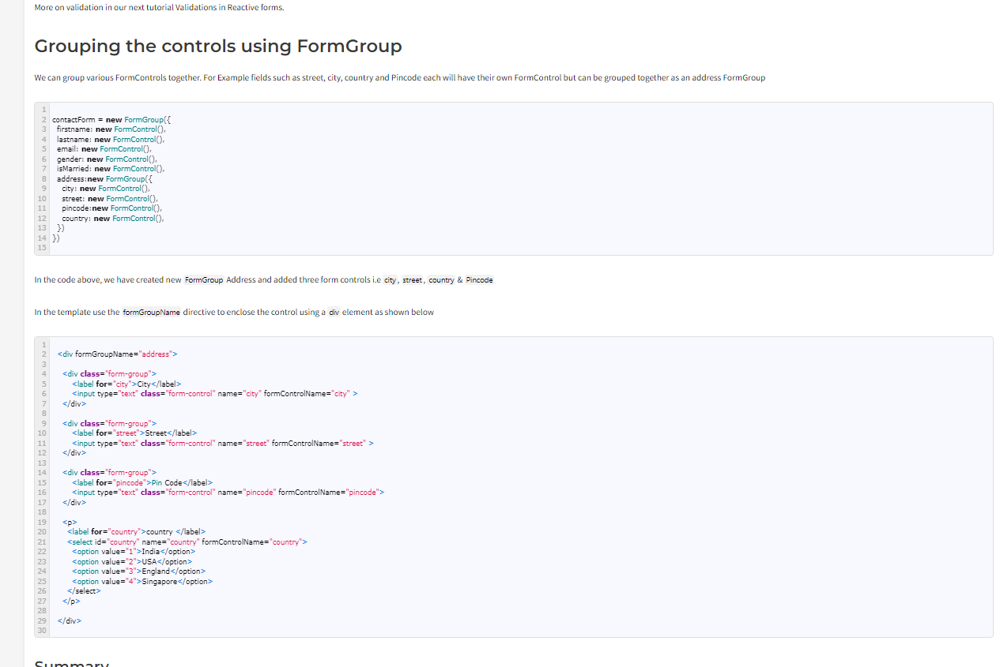
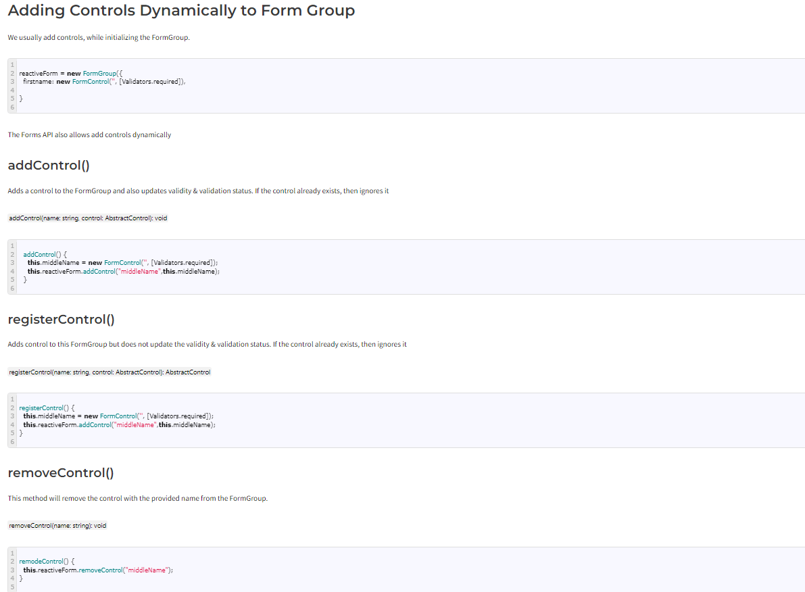
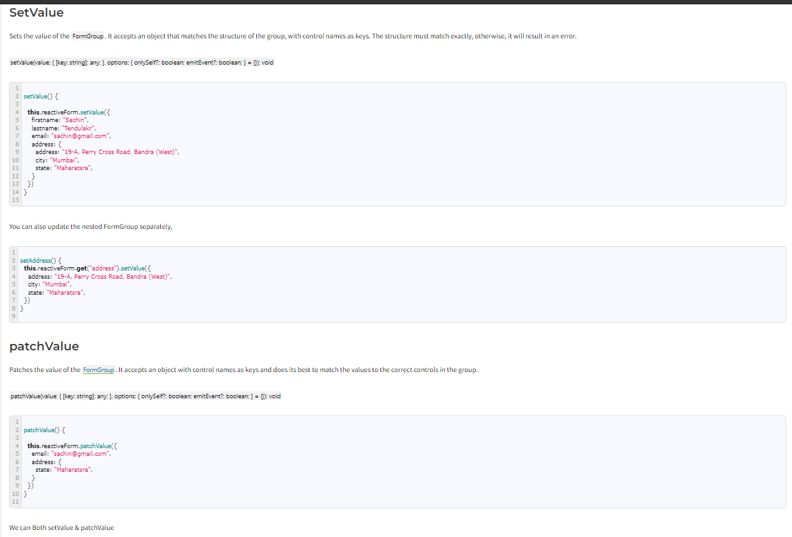
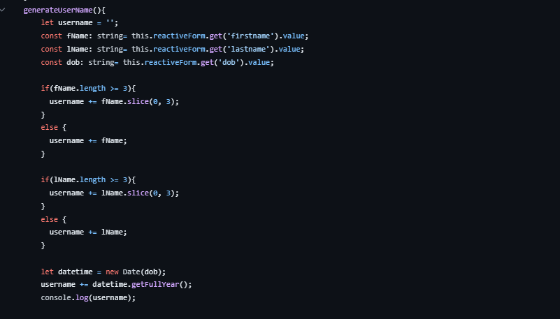
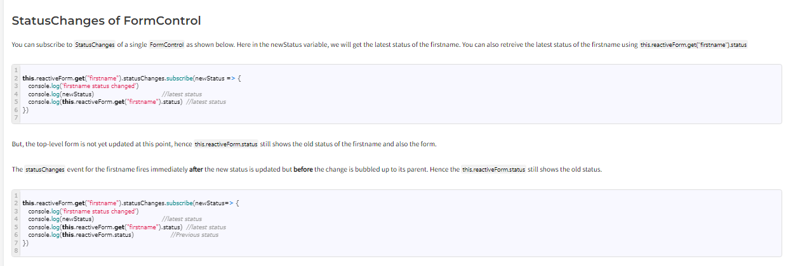

1. What is a reactive form in Angular and how to create it?

What are Reactive Forms?
Reactive forms are forms where we define the structure of the form in the component class. i.e. we create the form model with Form Groups, Form Controls, and FormArrays. We also define the validation rules in the component class. Then, we bind it to the HTML form in the template. This is different from the template-driven forms, where we define the logic and controls in the HTML template.

How to use Reactive Forms
Import ReactiveFormsModule
Create Form Model in component class using FormGroup, FormControl & FormArrays
Create the HTML Form resembling the Form Model.
Bind the HTML Form to the Form Model

Model
In the template-driven approach, we used ngModel & ngModelGroup directive on the HTML elements. The FormsModule automatically creates the FormGroup & FormControl instances from the HTML template. This happens behind the scene.

In the Reactive Forms approach, It is our responsibility to build the Model using FormGroup, FormControl and FormArray.

The FormGroup, FormControl & FormArray are the three building blocks of the Angular Forms. We learned about them in the Angular Forms Tutorial.

FormControl encapsulates the state of a single form element in our form. It stores the value and state of the form element and helps us to interact with them using properties & methods.

FormGroup represents a collection of form controls. It can also contain other FormGroups and FormArrays. In fact, an angular form is a FormGroup.

Let’s create the model for our Form.

First, we need to import FormGroup, FormControl & Validator from the @angular/forms. Open the app.component.ts and the add following import statement.
2. How to perform validation on a reactive form and creating custom validators?

<form [formGroup]="contactForm" (ngSubmit)="onSubmit()">
 
  

    <label for="firstname">First Name </label>
    <input type="text" id="firstname" name="firstname" formControlName="firstname">
  

 
  

    <label for="lastname">Last Name </label>
    <input type="text" id="lastname" name="lastname" formControlName="lastname">
  

 
  

    <label for="email">Email </label>
    <input type="text" id="email" name="email" formControlName="email">
  

 
  

    <label for="gender">Geneder </label>
    <input type="radio" value="male" id="gender" name="gender" formControlName="gender"> Male
    <input type="radio" value="female" id="gender" name="gender" formControlName="gender"> Female
  

 
  

    <label for="isMarried">Married </label>
    <input type="checkbox" id="isMarried" name="isMarried" formControlName="isMarried">
  

 
 
  

    <label for="country">country </label>
    <select id="country" name="country" formControlName="country">
      <option value="1">India</option>
      <option value="2">USA</option>
      <option value="3">England</option>
      <option value="4">Singapore</option>
    </select>
  

 
 
  

    <button type="submit">Submit</button>
  

 
</form>

Binding the template to the model
Now we need to associate our model with the above HTML Template. We need to tell angular that we have a model for the form.

This is done using the formGroup directive as shown below.

<form [formGroup]="contactForm">
 
We use the square bracket (one-way binding) around FormGroup directive and assign our form model (i.e. contactForm name that we gave to our model in the component class) to it.

Next, we need to bind each form field to an instance of the FormControl models. We use the FormControlName directive for this. We add this directive to every form field element in our form. The value is set to the name of the corresponding FormControl instance in the component class.

<input type="text" id="firstname" name="firstname" formControlName="firstname">
<input type="text" id="lastname" name="lastname" formControlName="lastname">
 
Submit form
We submit the form data to the component using the Angular directive named ngSubmit.  Note that we already have a submit button in our form. The ngSubmit directive binds itself to the click event of the submit button. We are using event binding (parentheses) to bind ngSubmit to OnSubmit method. When the user clicks on the submit button ngSubmit invokes the OnSubmit method on the Component class

<form [formGroup]="contactForm" (ngSubmit)="onSubmit()">

Receive the data in the Component class
The last step is to receive the form data in the component class. All we need to do is to create the onSubmit method in our component class.

 
onSubmit() {
  console.log(this.contactForm.value);
}
 

We are yet to add the onSubmit() method in the component class. Hence the Angular will throw an error here.

3. How to group form controls together using FormGroup and FormArray?

 this.reactiveForm = new FormGroup({
      firstname : new FormControl(null,[Validators.required, CustomValidators.noSpaceAllowed]),
      lastname : new FormControl(null,[Validators.required, CustomValidators.noSpaceAllowed]),
      email : new FormControl(null,[Validators.required , Validators.email]),
      username : new FormControl(null, Validators.required, CustomValidators.checkUserName),
      dob : new FormControl(null),
      gender : new FormControl('male'),
      address: new FormGroup({
        street : new FormControl(null),
        country : new FormControl('India'),
        city: new FormControl(null),
        region : new FormControl(null),
        postal : new FormControl(null),
      }),
      skills: new FormArray([
        new FormControl(null , Validators.required),
      ]),
      experience: new FormArray([
        new FormGroup({
          company: new FormControl(null),
          position: new FormControl(null),
          totalExp: new FormControl(null),
          start: new FormControl(null),
          end: new FormControl(null),
        })
      ])
4. How to add FormControl and FormGroup dynamically to a form?

5. Setting the value for a form control in reactive form using setValue & patchValue?

       used to update single field
       this.reactiveForm.get('username').setValue(username);

       best practive easy to update both single and multiple field
      this.reactiveForm.patchValue({
        username: username,
        address: {
          city: 'New Delhi'
        }
      })
6. Reading form data and re-setting a reactive form and many more things.
   
   To reset a reactive form in Angular, you can use the reset method provided by the FormGroup class. The reset method resets the form controls to their initial values and resets the form submission state.
   this.myForm.reset();
7. Status CHange in Reactive form?
The StatusChanges is an event raised by the Angular forms whenever the Angular calculates the validation status of the FormControl, FormGroup or FormArray. It returns an observable so that you can subscribe to it. The observable gets the latest status of the control. The Angular runs the validation check on every change made to the control. It also generates a list of validation errors in which case the status becomes INVALID. If there are no errors, then the status becomes VALID

this.reactiveForm.statusChanges.subscribe(newStaus => {
    console.log('form Status changed event')
    console.log(newStaus)
})

8. Value change of reactive form?
The ValueChanges is an event raised by the Angular forms whenever the value of the FormControl, FormGroup, or FormArray changes. It returns an observable so that you can subscribe to it. The observable get the latest value of the control. It allows us to track changes made to the value in real-time and respond to them. For example, we can use it to validate the value, calculate the computed fields, etc.

 
this.reactiveForm.valueChanges.subscribe(x => {
    console.log('form value changed')
    console.log(x)
})