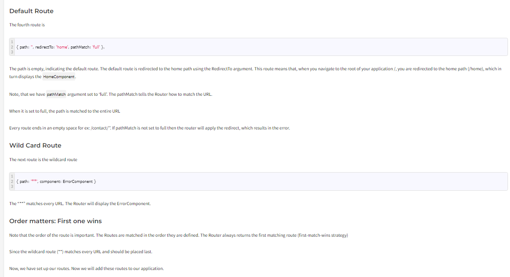
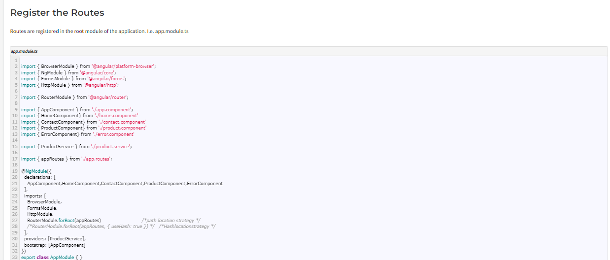
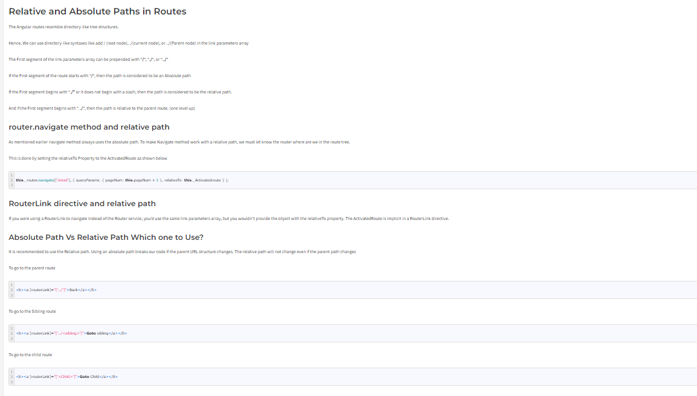
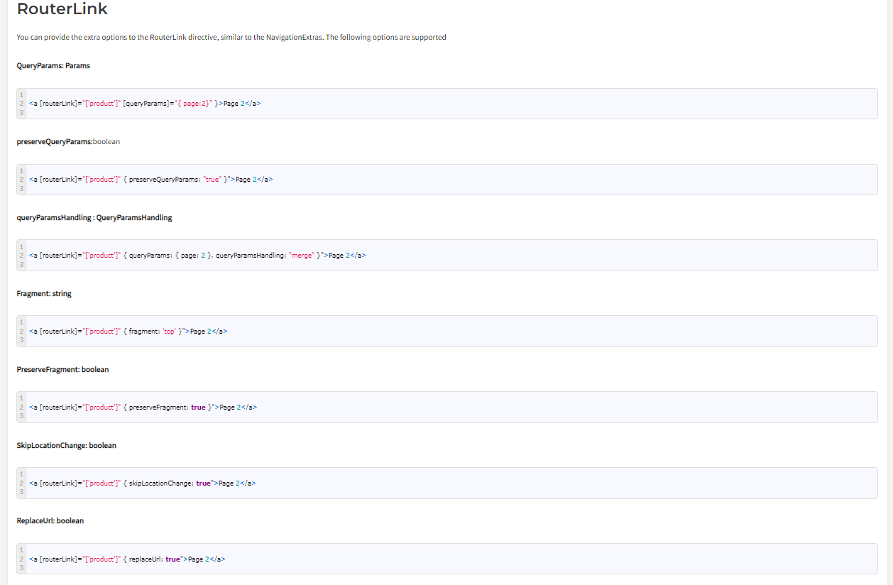

1. Introduction to Angular Routing. Set up and load routes with RouterModule in angular.

Routing allows you to move from one part of the application to another part or one View to another View.

In Angular, Routing is handled by the Angular Router Module.
Angular Router
The Router is a separate module in Angular. It is in its own library package, @angular/router. The Angular Router provides the necessary service providers and directives for navigating through application views.

Using Angular Router you can

Navigate to a specific view by typing a URL in the address bar
Pass optional parameters (query parameters) to the View
Bind the clickable elements to the View and load the view when the user performs application tasks
Handles back and forward buttons of the browser
Allows you to load the view dynamically
Protect the routes from unauthorized users using Route Guards

Components of Angular Router
Router
An Angular Router is a service (Angular Router API) that enables navigation from one component to the next component as users perform application tasks like clicking on menus links, and buttons, or clicking on the back/forward button on the browser. We can access the router object and use its methods like navigate() or navigateByUrl(), to navigate to a route

Route
Route tells the Angular Router which view to display when a user clicks a link or pastes a URL into the browser address bar. Every Route consists of a path and a component it is mapped to. The Router object parses and builds the final URL using the Route

Routes
Routes is an array of Route objects our application supports

RouterOutlet
The outerOutlet is a directive (<router-outlet>) that serves as a placeholder, where the Router should display the view

RouterLink
The RouterLink is a directive that binds the HTML element to a Route. Clicking on the HTML element, which is bound to a RouterLink, will result in navigation to the Route. The RouterLink may contain parameters to be passed to the route’s component.

RouterLinkActive
RouterLinkActive is a directive for adding or removing classes from an HTML element that is bound to a RouterLink. Using this directive, we can toggle CSS classes for active RouterLinks based on the current RouterState

ActivatedRoute
The ActivatedRoute is an object that represents the currently activated route associated with the loaded Component.

RouterState
The current state of the router includes a tree of the currently activated routes together with convenience methods for traversing the route tree.

RouteLink Parameters array
The Parameters or arguments to the Route. It is an array that you can bind to RouterLink directive or pass it as an argument to the Router.navigate method.

https://www.tektutorialshub.com/angular/angular-routing-navigation/#routes

2. Explain default route and Wild Card route?

3. Explain registering of routes?

The routermodule.forroot method returns the Router Service configured with the routes passed in the argument and also registers the Router service. It also registers the other providers that the routing module requires.

When the application is bootstrapped, the Router service looks at the current browser URL and performs the initial navigation.

When the user changes the URL either by clicking on a link in the page or by entering a URL in the address bar, the router looks for a corresponding Route from the Routes array and renders the associated component.

4. Navigating Links in the Page using RouterLink in the angular.
  <li class="nav-item"><a routerLink="/">Home</a></li>

5. We can use routerLink as property binding also  mostly for dynamic Purpose
  <li class="nav-item"><a [routerLink]="['/users']">Users</a></li>

6. Styling the Active Router Link using routerLinkActive and routerLinkActiveOptions in angular.
 <li class="nav-item"><a class="nav-link" routerLink="/" routerLinkActive="active" [routerLinkActiveOptions]="{exact:true}">Home</a></li>
 This routerLinkActiveOptions is to resolve parent child routing issues for exact path matching

7. Navigate between pages using router programmatically in Typescript code in angular.
 onCategoriesClick(){
    this.router.navigateByUrl('/categories'); - Way 1
    this.router.navigate(['categories']); - Way 2
  }

8. Passing and Fetching Parameters to Routes using ActivatedRoute snapshot in Angular. 
Use ActivatedRoute instead of Router for getting status of active route.

In app Module :
{ path: 'users/:id/:name' , component : UserComponent},
user : { id: number ; name:string};
  constructor(private route: ActivatedRoute){
    
  }

  ngOnInit(){
    this.user ={
      id : this.route.snapshot.params['id'],
      name : this.route.snapshot.params['name']
    };

9. Fetch Route Parameters Reactively using Params Subscribe with ActivatedRoute in angular.
 this.route.params.subscribe((data)=>{
      this.user= {
        id: data['id'],
        name: data['name']
      }
    })

10.  Passing Query Parameters and Fragments to the Url Route with the Template and Program in Angular

Url Obtained: https://angularroutingformspipes-tov4--4200--420f2654.local-corp.webcontainer.io/#/users/1/John?page=1&search=Smith#searching

<a [routerLink]="['/users',1,'John']"[queryParams]="{page:1 , search:'Smith'}" [fragment]="'searching'"> Click to Search</a>

Using Programatic Approach:

https://angularroutingformspipes-tov4--4200--420f2654.local-corp.webcontainer.io/#/users/2/Rama?page=3&search=RSA#current

    <button (click)="getRouterDetails()">Click Me Again!</button>

  getRouterDetails(){
    this.router.navigate(['/users',2,'Rama'], {
      queryParams: { page:3 , search:'RSA'},
      fragment: 'current'

    })
  }

11.  Retrieving Query Parameters and Fragments from the URL through Typescript Code in the angular?
    All about query params : https://www.tektutorialshub.com/angular/angular-passing-optional-query-parameters-to-route/
    
    console.log(this.route.snapshot.queryParams);
    console.log(this.route.snapshot.fragment);
    Best Way:
    this.route.queryParams.subscribe((data)=>{
      console.log(data);
    })

    this.route.fragment.subscribe((data)=>{
      console.log(data);
    })

    Adding Query Parameters
The Query parameters are not part of the route. Hence you do not define them in the routes array like route parameters. There are two ways in which you can pass a Query Parameter to Route

Using routerlink directive
Using router.navigate method.
Using the router.navigateByUrl method
Using routerlink Directive in Template
We use the queryParams property of the routerlink directive to add the query parameter. We add this directive in the template file.

 
<a [routerLink]="['product']" [queryParams]="{ page:2 }">Page 2</a>
 
The router will construct the URL as

 
/product?page=2
 
You can pass multiple Query Parameters as shown below

<a [routerLink]="['products']"
                           [queryParams]="{ color:'blue' , sort:'name'}">Products</a>
 
The router will construct the URL as

 
/products?color=blue&sort=name
 
Using router.navigate method in Component
You can also navigate programmatically using the navigate method of the Router service as shown below

goTo() {     
    this.router.navigate(
        ['/products'], 
        { queryParams: { page: 2, sort:'name'} }
    ); 
}
 
The above code will navigate to the following URL

 
/products?page=2&sort=name
 
Using the router.navigateByUrl method in the component
You can also use the navigateByUrl method of the router. navigateByUrl expects an absolute URL, Hence we need to build our query string programmatically. Also, the navigateByUrl method does not have queryParamsHandling option.

 
this.router.navigateByUrl('product?pageNum=2');

Retrieve the parameter in the component
Finally, our component needs to extract the route parameter from the URL

This is done via the ActivatedRoute service from the angular router module to get the parameter value

ActviatedRoute
The ActivatedRoute is a service, which keeps track of the currently activated route associated with the loaded Component.

To use ActivatedRoute, we need to import it into our component

product-detail.component.ts

import { ActivatedRoute } from '@angular/router';
 
Then inject it into the component using dependency injection

product-detail.component.ts

 
constructor(private _Activatedroute:ActivatedRoute)
 
There are two properties that ActviatedRoute routes provide, which contain the Route Parameter.

ParamMap
Params

ParamMap
The Angular adds the map of all the route parameters in the ParamMap object, which can be accessed from the ActivatedRoute service

The ParamMap has three methods, which makes it easier to work with the route parameters.

get method retrieves the value of the given parameter.

getAll method retrieves all parameters

has method returns true if the ParamMap contains a given parameter else false

Params
The Angular ActviatedRoute also maintains the Route Parameters in the Params array. The Params array is a list of parameter values, indexed by name.

Reading the Route Parameters
There are two ways in which you can use the ActivatedRoute to get the parameter value from the ParamMap object.

Using the Snapshot property of the ActivatedRoute
Subscribing to the paramMap or params observable property of the ActivatedRoute
Using Snapshot
The snapshot property returns the current value of the route. It does not contain any observable. Hence if the value changes after you retrieve the values, you will not be notified of it. The snapshot contains both paramMap & params array. You can use any of them to read the value of id.

The following code reads the value from the paramMap object.

this.id=this._Activatedroute.snapshot.paramMap.get("id");
 
Code to read the router parameter from the params array.

 
this.id=this._Activatedroute.snapshot.params["id"];

Using Observable
The ActivatedRoute also contains the paramMap & params observable. We can subscribe to it and listen for changes. The paramMap observable emits the paramMap object, while the params observable emits the params array.

The following code subscribes to the paramMap observable. We use the get method to read the value of id.

 
this._Activatedroute.paramMap.subscribe(paramMap => { 
    this.id = paramMap.get('id'); 
});
 
The code to subscribe to the params observable

this._Activatedroute.params.subscribe(params => { 
    this.id = params['id']; 
});

QUERYPARAMS:

Reading Query Parameters
Reading the Query parameters is similar to reading the Router Parameter. There are two ways by which you can retrieve the query parameters.

Subscribing to the queryParamMap or queryParams observable
Using queryParamMap or queryParams property of the snapshot property
Both the above are part of the ActivatedRoute service. Hence we need to inject it into our component class.

Using queryParamMap observable
The queryParamMap is a Observable that returns a ParamMap of the query parameters available to the current route. We can use this to retrieve values from the query parameter. The queryParamsMap is accessible via ActivatedRoute

Hence, we need to inject the ActivatedRoute in the constructor of the component/service, where we want to read the query parameter as shown below

 
   constructor(private Activatedroute:ActivatedRoute,
               private router:Router){
   }
 
You can subscribe to the queryParamMap of the ActivatedRoute, which returns the
observable of type ParamMap.

The ParamMap object contains three methods

get method retrieves the value of the given parameter.

getAll method retrieves all parameters

has method returns true if the ParamMap contains a given parameter else false

We use the get method to read the query parameter as shown below. The following code reads the value of the pageNum query parameter.

 
this.sub = this.Activatedroute.queryParamMap
       .subscribe(params => {
             this.pageNum = +params.get('pageNum')||0;     
});
 
Using queryParams observable
The queryParams is a Observable that returns a Params. The Params array is a list of parameter values, indexed by name.

The following code shows how to subscribe and retrieve the value of pageNum query parameter.

 
this.sub = this.Activatedroute.queryParams
       .subscribe(params => {
             this.pageNum = +params.['pageNum']||0;     
});
 
Using snapshot.queryParamMap property
You can also read the value of the query parameter from queryParamMap using the snapshot property of the ActivatedRoute as shown below

 
this.Activatedroute.snapshot
       .queryParamMap.get('pageNum')||0;;
 
Using snapshot.queryParams property
You can also read the value of the query parameter from queryParams property of the snapshot property.

this.Activatedroute.snapshot
       .queryParams['pageNum']||0;;
 

 QUERYPARAMSHANDLING:

queryParamsHandling
The query parameter is lost when the user navigates to another route.

For Example, if a user navigates to the product page with the route /product?pageNum=2 and later navigates to the product detail page, angular removes the query parameter from the URL. This is the default behavior

You can change this behavior by configuring the queryParamsHandling strategy. This Configuration strategy determines how the angular router handles query parameters when the user navigates away from the current route. It has three options

“”
preserve
merge
queryParamsHandling:”
This is the default option. The angular removes the query parameter from the URL when navigating to the next route.

 
this.router.navigate(['product'], 
        { queryParams: { pageNum: this.pageNo + 1 }, 
        queryParamsHandling :''}   );
 

 
<a [routerLink]="['product']" 
                            [queryParams]="{ pageNum:2 }">Page 2</a>
 
queryParamsHandling preserve
The Angular preserves or carries forwards the query parameter of the current route to the next navigation. Any query parameters of the next route are discarded

 
this.router.navigate(['product'], 
          { queryParams: { pageNum: this.pageNo + 1 }, 
            queryParamsHandling :"preserve"}   
);

 
<a [routerLink]="['product']" 
                            [queryParams]="{ pageNum:2 }" 
                            queryParamsHandling="preserve">Page 2</a>
 
queryParamsHandling merge
The Angular merges the query parameters from the current route with that of the next route before navigating to the next route.

 
this.router.navigate(['product'], 
                { queryParams: { pageNum: this.pageNo + 1 }, 
                queryParamsHandling :"merge"}  
 );
 

 
<a [routerLink]="['product']" 
                           [queryParams]="{ pageNum:2 }" 
                           queryParamsHandling="merge">Page 2</a>

Which one to use? snapshot or observable
We usually retrieve the value of the Query parameter in the ngOninit life cycle hook, when the component is initialized.

When the user navigates to the component again, and if the component is already loaded then, Angular does not create the new component but reuses the existing instance. In such circumstances, the ngOnInit method of the component is not called again.

If you are using the Snapshot to read the value of the Query parameters in ngOnInit, then you will be stuck with the values that you read when the component is loaded for the time. This is because Snapshot is not observable. Hence it will not notify you if the value changes.

By subscribing to the paramMap observable (or to the params observable), you will get a notification when the value changes. Hence you can retrieve the latest value of the parameter and update the component accordingly.

Which one to use? snapshot or observable
We usually retrieve the value of the parameter in the ngOninit life cycle hook, when the component is initialized.

When the user navigates to the component again, and if the component is already loaded then, Angular does not create the new component but reuses the existing instance. In such circumstances, the ngOnInit method of the component is not called again. Hence you need a way to get the value of the parameter.

By subscribing to the paramMap observable (or to the params observable), you will get a notification when the value changes. Hence you can retrieve the latest value of the parameter and update the component accordingly.

We recommend you use the subscribe method as it offers the benefit of responding to the parameter changes dynamically.

12. All about Child Routes?
https://www.tektutorialshub.com/angular/angular-child-routes-nested-routes/

 Setting up the child or Nested Routes using the children key in routing module in the Angular. 
    DO:
    { path: 'users' ,
    component : UsersComponent,
    children : [{path: ':id/:name' , component:UserComponent}]},

    DON'T
    // { path: 'users/:id/:name' , component : UserComponent},

13. RouterLink, Navigate & NavigateByUrl to Navigate Routes

Navigating between Angular routes
You can navigate between routes in Angular 2 in two ways

Using RouterLink Directive
Via Code
RouterLink directive
We looked at how to navigate using the RouterLink directive in the previous tutorials.

The RouterLink is a directive, which you can use to bind any clickable HTML element to a Route. When the user clicks on the HTML element the router will navigate to the associated Route.

For Example

 
<li><a [routerLink]="['product']">Product</a></li>
 
Will map to URL “/product” and renders the associated ProductComponent

Navigating Using Code
You can also navigate imperatively by using the code. This is done using the router service, which provides navigate and navigatebyUrl methods via which you can perform route changes.

router.navigate
Use this method, if you want to Navigate to a route using the link parameters array. The first argument to the navigate method is link parameters array, which is similar to what we provide while defining the routerlink directive

Navigate Method always uses the absolute path unless you provide a starting point.

navigate.navigateByUrl

Use this method if you want to navigate to a URL by using the absolute path. The first argument is a string containing the complete URL.

NavigateByUrl Method always uses the absolute path

To use both these methods, we need to inject router service into our component as shown below

 
constructor(private _router:Router){
}
 
And then invoke

 
this._router.navigate(['product']
 
Or

 
this._router.navigateByUrl('product')
 
To navigate to the desired route.

 
constructor(private _router:Router){
}
 
And then invoke

 
this._router.navigate(['product']
 
Or

this._router.navigateByUrl('product')
 
To navigate to the desired route.

ABSOLUTE VS RELATIVE PATHS

14. SOME NAVIGATION EXTRAS:

https://www.tektutorialshub.com/angular/angular-navigating-between-routes/#navigationextras

15. Commonly used routerlinks params:

