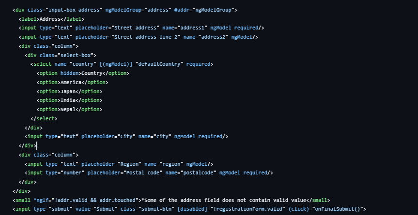
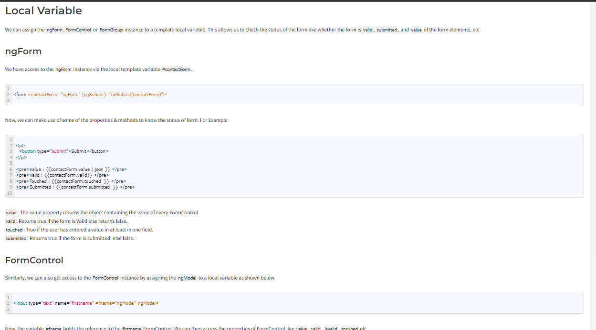

1. Explain Angular Forms Fundamentals? FormControl vs FormGroup vs FormArray?
https://www.tektutorialshub.com/angular/angular-forms-fundamentals/

2. What is a template driven form and how to create it?

 Template Driven Forms we specify behaviors/validations using directives and attributes in our template and let it work behind the scenes. All things happen in Templates hence very little code is required in the component class. This is different from the reactive forms, where we define the logic and controls in the component class.

The Template-driven forms 

The form is set up using ngForm directive
controls are set up using the ngModel directive
ngModel also provides the two-way data binding
The Validations are configured in the template via directives
Template-driven forms are

Contains little code in the component class 
Easier to set up 
While they are

Difficult to add controls dynamically
Unit testing is a challenge
Import FormsModule
To work with Template-driven forms, we must import the FormsModule. We usually import it in root module or in a shared module. The FormsModule contains all the form directives and constructs for working with forms

Open the app.module.ts and add the import { FormsModule } from '@angular/forms'; to it.

And also add the FormsModule to the imports metadata property array

ngForm
Once, we have a form with few form elements, the angular automatically converts it into a Template-driven form. This is done by the ngForm directive.

The ngForm directive is what makes the Angular template-driven forms work. But we do not need to add it explicitly. Angular adds it automatically

When we include FormsModule, the Angular is going to look out for any <form> tag in our HTML template. Angular does this via ngForm directive. ngForm directive automatically detects the <form> tag and automatically binds to it. You do not have to do anything on your part to invoke and bind the ngForm directive.

The ngForm does the following

Binds itself to the <Form> directive
Creates a top-level FormGroup instance
CreatesFormControl instance for each of child control, which has ngModel directive.
CreatesFormGroup instance for each of the  NgModelGroup directive.
We can export the ngForm instance into a local template variable using ngForm as the key (ex: #contactForm="ngForm"). This allows us to access the many properties and methods of ngForm using the template variable contactForm

Hence, update the form element as shown below.

FormControl
The FormControl is the basic building block of the Angular Forms. It represents a single input field in an Angular form. The Angular Forms Module binds the input element to a FormControl. We use the FormControl instance to track the value, user interaction and validation status of an individual form element. Each individual Form element is a FormControl

3. How to retrieve the values from the form elements of a template driven form?

<form #contactForm="ngForm" (ngSubmit)="onSubmit(contactForm)">
 
  

    <label for="firstname">First Name</label>
    <input type="text" name="firstname" ngModel>
  

 
  

    <label for="lastname">Last Name</label>
    <input type="text" name="lastname" ngModel>
  

 
  

    <label for="email">Email </label>
    <input type="text" id="email" name="email" ngModel>
  

 
  

    <label for="gender">Geneder</label>
    <input type="radio" value="male" name="gender" ngModel> Male
    <input type="radio" value="female" name="gender" ngModel> Female
  

 
  

    <label for="isMarried">Married</label>
    <input type="checkbox" name="isMarried" ngModel>
  

 
  <select name="country" ngModel>
    <option [ngValue]="c.id" *ngFor="let c of countryList">
      {{c.name}}
    </option>
  </select>
 
  

    <button type="submit">Submit</button>
  

  
</form>
 
4. How to group form controls together?

5. How to perform validation on a template driven form?

  <form class="form" (ngSubmit)="onFormSubmitted(registrationForm)" #registrationForm="ngForm">

6. Setting the value for a form control in template driven form?
 @ViewChild('registrationForm') form: NgForm

 
    Not possible to assign to read only VALUE
     this.form.controls['username'].value = username;
     console.log(this.form.value.username)

     It requires you to provide an object that matches the structure of the form. If you don't provide values for all controls, it will throw an error.

    Correct order to setvalue: 

      this.form.setValue({
       firstname: this.form.value.firstname,
       lastname: this.form.value.lastname,
       email: this.form.value.email,
       phonenumber: this.form.value.phonenumber,
       dateofbirth: this.form.value.dateofbirth,
       gender: this.form.value.gender,
       username: username,
       address: {
         address1: this.form.value.address.address1,
         address2: this.form.value.address.address2,
         country: this.form.value.address.country,
         city: this.form.value.address.city,
         region: this.form.value.address.region,
         postalcode: this.form.value.address.postalcode
       }
     })

     PatchValue: Using this we can update any single or set of values:
     patchValue Method:
The patchValue method is more flexible than setValue. It allows you to set values for a subset of form controls. It won't throw an error if you don't provide values for all controls.

     this.form.form.patchValue({
      username: username
         address: {
         country: 'Japan'
       }
    })

7. Re-setting a form and many more things.

this.form.reset();

More Detail: https://github.com/rsa3698/Template-Driven-Form/tree/main